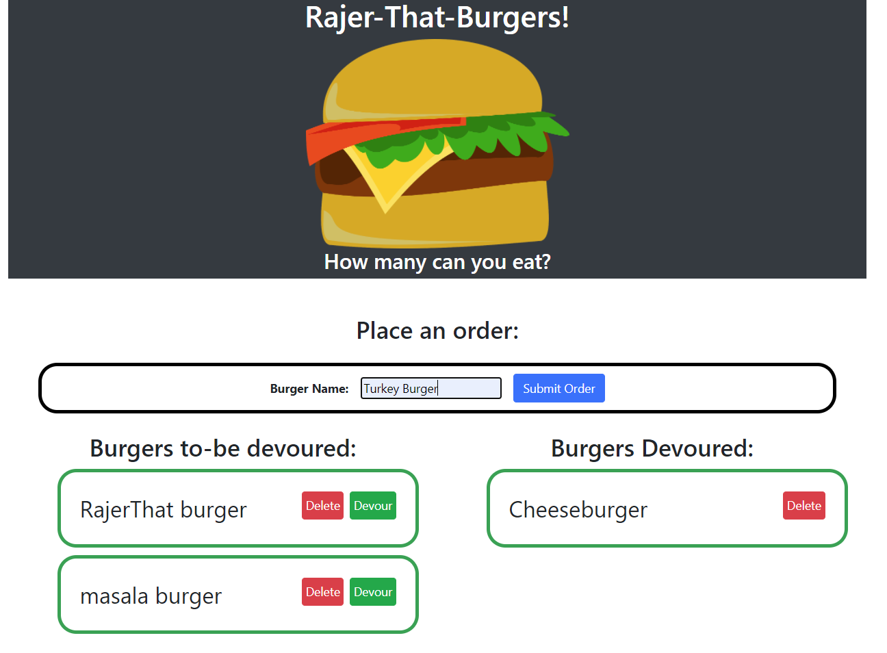

# Rajer-That-Burger

## Table of Contents

- [Description](#Description)
- [Tools_Used](#Tools_Used)
- [Links](#Links)
- [Application-Screen-Shots](#Application-Screen-Shots)
- [Credits](#Credits)

### Description

For this project, I created a burger logger with MySQL, Node, Express, Handlebars and a homemade ORM. To create this application, I followed the MVC design pattern; used Node and MySQL to query and route data in the app, and Handlebars to generate the HTML.

This app allows users to orders burgers that they want to devour. Once they submig the burger order, the order then appears under the "Burgers to-be devoured" section of the application. Then the user has a choice to either delete the order or devour the burger. If the user devours the burger, then the order is moved into a section called "Burgers devoured. If the user chooses to delete the order, then the order is removed from the "Burgers to be devoured" list.

## Tools Used

- HTML
- CSS
- JavaScript
- Bootstrap
- jQuery
- NPM Express
- NPM Express-handlebars
- MySQL database
- Node.js
- MVC design structure

## Links (Application & Repo)

Rajer-That-Burger can be accessed at heroku link provided below:

Heroku Pages URL: <>

Github Repository: <https://github.com/rajdeep24/Eat-Da-Burger>

### Screenshots

#### Homepage

## Credits

I would like to credit georgia tech's coding bootcamp and the support from my peers.

## Badges

